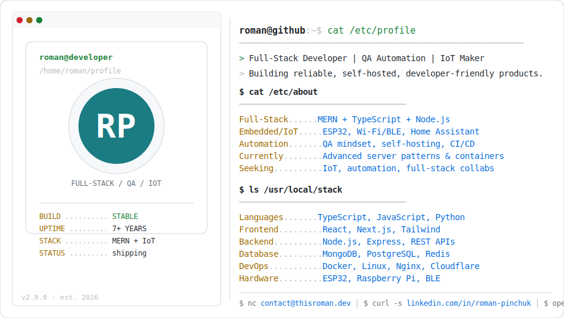

  <a href="https://github.com/roman-pinchuk/roman-pinchuk">
    <picture>
      <source media="(prefers-color-scheme: dark)" srcset="dark_mode.svg">
      
    </picture>
  </a>

   

  
  

   

  

  

    
  

