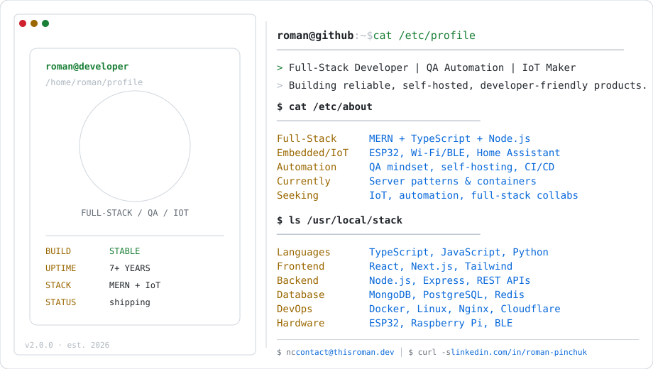

  <a href="https://github.com/roman-pinchuk/roman-pinchuk">
    <picture>
      <source media="(max-width: 600px) and (prefers-color-scheme: dark)" srcset="mobile_dark_mode.svg">
      <source media="(max-width: 600px) and (prefers-color-scheme: light)" srcset="mobile_light_mode.svg">
      <source media="(prefers-color-scheme: dark)" srcset="dark_mode.svg">
      
    </picture>
  </a>

   
  

    
     
      
  

